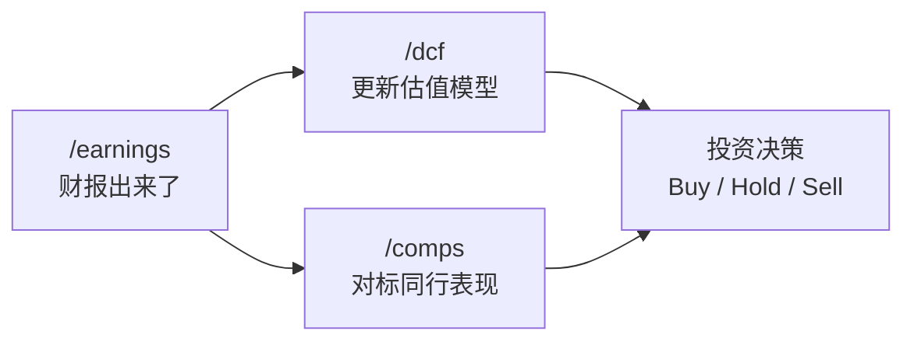

# A股金融分析工具使用指南
# A-Share Financial Analysis Workflows Guide

---

## 快速开始 / Quick Start

本项目包含三个核心 Workflow，适配 A 股市场，可通过斜杠命令直接调用：

| 命令 | 功能 | 示例 |
|------|------|------|
| `/dcf [公司]` | DCF 现金流折现估值 | `/dcf 贵州茅台` or `/dcf 600519` |
| `/comps [公司]` | 可比公司分析 | `/comps 宁德时代` or `/comps 300750` |
| `/earnings [公司] [季度]` | 财报分析报告 | `/earnings 比亚迪 2025Q3` |

> 也可以用自然语言触发，例如 `"帮我做隆基绿能的DCF估值"`。

---

## 三大 Workflow 详解

### 1. `/dcf` — DCF 现金流折现估值

**用途 / Purpose**：计算公司内在价值，输出专业 Excel 估值模型。

**输入 / Input**：
```
/dcf 贵州茅台
/dcf 600519 预测期7年 终值增长率3%
/dcf 宁德时代 悲观8%增长 基准15% 乐观22%
```

**输出 / Output**：
- `[代码]_DCF_Model_[日期].xlsx` — 含 DCF + WACC 两个 Sheet
- 三情景（悲观/基准/乐观）一键切换
- 底部三张敏感性分析表（75个公式全填充）

**A 股适配要点 / A-Share Adaptations**：
- 无风险利率 → 中国10年期国债收益率（~2.0-2.5%）
- Beta → 相对沪深300的5年月度Beta
- 税率 → 25%（高新技术企业15%）
- 永续增长率 → 2.0-5.5%（中国GDP增速预期高于美国）
- 单位 → 人民币百万元 (¥M)

---

### 2. `/comps` — 可比公司分析

**用途 / Purpose**：对标同行业公司，横向比较估值和经营效率。

**输入 / Input**：
```
/comps 贵州茅台
/comps 白酒行业
/comps 宁德时代 vs 比亚迪 vs 亿纬锂能 vs 国轩高科
```

**输出 / Output**：
- `[行业/公司]_Comps_[日期].xlsx`
- 经营指标区（营收、增速、利润率等）
- 估值倍数区（PE、PB、EV/EBITDA 等）
- 统计区（最大、75%、中位数、25%、最小）

**A 股适配要点 / A-Share Adaptations**：
- 行业分类 → 申万行业标准
- 可选指标 → 北向持股比例、融资余额、股东户数变化
- 数据源 → 东财行业板块 API + 财务指标 API
- 扣非净利润 → 作为核心盈利指标（排除非经常性损益）

---

### 3. `/earnings` — 财报分析报告

**用途 / Purpose**：产出 8-12 页专业财报点评报告（DOCX），快速解读最新业绩。

**输入 / Input**：
```
/earnings 贵州茅台 2025Q3
/earnings 宁德时代               ← 自动检索最新季报
/earnings 比亚迪 2025年报
```

**输出 / Output**：
- `[公司]_[年]Q[季]_业绩点评.docx` — 8-12页报告
- 8-12 张嵌入式图表
- 1-3 张摘要表格
- 完整的数据来源引用

**报告结构 / Report Structure**：

| 页码 | 内容 |
|------|------|
| 1 | 业绩摘要 + 评级 + 目标价 |
| 2-3 | 详细业绩分析（超预期/不及预期）|
| 4-5 | 关键指标 + 管理层指引 |
| 6-7 | 投资逻辑更新 + 风险提示 |
| 8-10 | 估值与预测修正 |
| 11-12 | 附录（可选）|

**A 股适配要点 / A-Share Adaptations**：
- 数据来源 → 巨潮资讯网公告原文（最权威）
- 重点指标 → 扣非后归母净利润（非GAAP净利润）
- 特殊关注 → 政府补贴、资产减值、会计政策变更
- 一致预期 → 东财机构一致预期数据
- 管理层指引 → 从投资者关系活动记录表中提取

---

## 数据源汇总 / Data Source Summary

所有 Workflow 共用以下 A 股数据接口：

| 数据源 | 主要用途 | 需要认证 |
|--------|---------|---------|
| 东方财富 API | 行情、财务数据、估值、一致预期 | 否 |
| 巨潮资讯网 | 公告原文 PDF | 否 |
| 同花顺 iFinD | 行业数据、概念分类 | 否 |
| 新浪财经 | 实时行情、历史K线 | 否 |
| Web 搜索 | 最新研报、管理层指引 | 否 |

> 所有接口均为公开或半公开，无需付费订阅。

---

## 组合使用 / Workflow Combinations

三个 Workflow 可以串联使用，形成完整的投研工作流：



**典型场景 / Typical Scenarios**：

1. **季报发布后 / Post-Earnings**：
   ```
   → /earnings 宁德时代 2025Q3    ← 先看业绩超不超预期
   → /dcf 宁德时代                ← 用新数据更新 DCF
   → /comps 宁德时代              ← 看估值在同行中的位置
   ```

2. **寻找投资机会 / Idea Screening**：
   ```
   → /comps 光伏行业              ← 先看哪家便宜
   → /dcf 隆基绿能                ← 深入分析低估值公司
   → /earnings 隆基绿能 2025Q3    ← 最新业绩验证逻辑
   ```

3. **持仓跟踪 / Portfolio Monitoring**：
   ```
   → /earnings 贵州茅台 2025Q3    ← 业绩符合预期吗？
   → /comps 贵州茅台              ← 估值合理吗？
   ```

---

## 常见问题 / FAQ

**Q: 数据多久更新一次？**
A: 每次运行 Workflow 都会实时通过 API 抓取最新数据。不存在缓存问题。

**Q: 可以分析港股/美股吗？**
A: 当前 Workflow 专为 A 股适配（数据源、税率、行业分类）。港股/美股建议使用原版 financial-services-plugins 的 Skills。

**Q: API 访问有限制吗？**
A: 东财等公开 API 有频率限制，正常使用不会触发。如遇问题，加 1-2 秒延迟即可。

**Q: 能自定义模板吗？**
A: 可以。每个 Workflow 文件都是 Markdown，直接编辑 `.agents/workflows/` 下的对应文件即可修改分析流程、格式标准、指标选择等。
