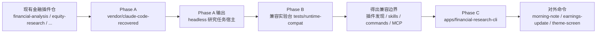

# Plan: 金融研究 Agent 路线图（按 3 -> 1 -> 2 推进）

## 问题框架

当前仓库已经有两类关键资产，但它们还没有被串成一个真正可交付的产品：

1. 金融插件仓本身已经有成熟的 `commands/`、`skills/`、`.claude-plugin/plugin.json` 和 MCP 工作流资产。
2. 恢复出来的 Claude Code runtime 已经具备 headless、plugin、MCP、Tool、QueryEngine、SDK 控制协议等宿主能力。

这份计划的目标，不是继续做“源码考古”，而是把现有资产按推荐顺序推进到一个真正有用的落地路径：

1. 先做 `3`：Headless 研究自动化引擎
2. 再做 `1`：Claude Code 兼容实验台
3. 最后做到 `2`：金融研究专用 Agent CLI

## 范围边界

### In Scope

- 把恢复 runtime 从临时目录迁到稳定、可版本化的位置
- 让 runtime 能以 headless 方式驱动本仓金融插件资产
- 建立插件兼容性测试台，验证 `plugin/skills/commands/MCP` 的可加载性
- 在前两步成立后，基于 headless host 包一层金融研究专用 CLI

### Out of Scope

- 现在就做 `4`：替代模型后端
- 现在就做 `5`：企业安全/合规加强版
- 追求与官方 Claude Code 的 100% 行为一致
- 大规模重写现有金融插件内容
- 构建 GUI、Web 控制台或桌面端产品壳

## 需求追踪

本计划直接来自当前会话需求，而不是既有 requirements 文档。

明确目标：

- 给出现实可做、收益明确的路线
- 按推荐顺序推进到方案 `2`
- 不再继续发散做 runtime 分析
- 产出一份可执行的技术路线，而不是泛泛建议

成功标准：

- 存在一个稳定、可构建的 runtime 宿主目录，而不是继续依赖 `.tmp/`
- 能用 headless 模式跑至少 2-3 个金融研究工作流
- 能验证当前插件仓在恢复 runtime 上的兼容性边界
- 能提供一个薄而实用的金融研究 CLI，对外暴露少量高价值命令

## 本地上下文与研究结论

### 仓库现状

- 根仓是一个金融插件 marketplace，核心资产分布在 [financial-analysis](C:/Users/rickylu/.gemini/antigravity/scratch/financial-services-plugins/financial-analysis)、[equity-research](C:/Users/rickylu/.gemini/antigravity/scratch/financial-services-plugins/equity-research)、[investment-banking](C:/Users/rickylu/.gemini/antigravity/scratch/financial-services-plugins/investment-banking) 等目录。
- 各插件已经符合 `.claude-plugin/plugin.json + commands/ + skills/ (+ hooks/MCP)` 的宿主预期。
- README 已经把该仓定义为兼容 Claude Code 的插件 marketplace，说明“挂到 Claude Code 风格 runtime 上”是符合仓库方向的，而不是偏题。

### 恢复 runtime 现状

- 恢复工程位于 [.tmp/cc-recovered-main/cc-recovered-main](C:/Users/rickylu/.gemini/antigravity/scratch/financial-services-plugins/.tmp/cc-recovered-main/cc-recovered-main)。
- 它已经具备关键宿主入口：
  - [src/main.tsx](C:/Users/rickylu/.gemini/antigravity/scratch/financial-services-plugins/.tmp/cc-recovered-main/cc-recovered-main/src/main.tsx)
  - [src/cli/print.ts](C:/Users/rickylu/.gemini/antigravity/scratch/financial-services-plugins/.tmp/cc-recovered-main/cc-recovered-main/src/cli/print.ts)
  - [src/QueryEngine.ts](C:/Users/rickylu/.gemini/antigravity/scratch/financial-services-plugins/.tmp/cc-recovered-main/cc-recovered-main/src/QueryEngine.ts)
  - [src/query.ts](C:/Users/rickylu/.gemini/antigravity/scratch/financial-services-plugins/.tmp/cc-recovered-main/cc-recovered-main/src/query.ts)
  - [src/cli/handlers/plugins.ts](C:/Users/rickylu/.gemini/antigravity/scratch/financial-services-plugins/.tmp/cc-recovered-main/cc-recovered-main/src/cli/handlers/plugins.ts)
  - [src/services/mcp/types.ts](C:/Users/rickylu/.gemini/antigravity/scratch/financial-services-plugins/.tmp/cc-recovered-main/cc-recovered-main/src/services/mcp/types.ts)

### 外部研究决定

这次先 **不做外部研究**。

原因：

- 当前规划对象就是“本仓插件资产 + 本地恢复 runtime”的组合方式。
- 关键接口面已经都在本地源码和 README/AGENTS 中。
- 现在最重要的是做边界设计和落地顺序，而不是补充外部资料。

## 关键技术决策

### 1. 把恢复 runtime 固化到稳定 vendor 路径，而不是继续依赖 `.tmp`

决定：

- 新建 `vendor/claude-code-recovered/` 作为稳定宿主目录。

理由：

- `.tmp/` 按仓库安全规则不应该进入长期开发面，更不适合作为产品依赖。
- runtime 是第三方/恢复来源资产，放在 `vendor/` 比放在根目录更清晰。
- 后续做差异补丁、升级、替换时边界最明确。

### 2. 先做 headless host，不先做专用 CLI 壳

决定：

- 第一个可交付物是“能脚本化跑研究任务”的 headless 宿主，而不是交互式 UI 或产品壳。

理由：

- 这是最短路径价值，能最快验证这条路线到底能不能产生产出。
- 后面的兼容实验台和专用 CLI 都能复用这一层。
- 如果 headless 层都不稳定，先做 CLI 壳只会放大返工。

### 3. 金融工作流逻辑继续以现有插件资产为主，不在 CLI 代码里复制一套

决定：

- 现有金融工作流的真实知识来源继续放在：
  - 插件 `commands/`
  - 插件 `skills/`
  - 插件 MCP 配置和帮助脚本

CLI 只是提供“运行入口、参数整理、结构化输出和默认模板”。

理由：

- 避免出现“两套金融逻辑”：插件一套，CLI 一套。
- 继续保持这个仓“插件 marketplace”作为源头资产。
- 让 CLI 成为薄适配层，后续维护成本最低。

### 4. 在做专用 CLI 之前，先建立兼容实验台

决定：

- 阶段二必须先验证插件发现、命令发现、skills 注入、MCP 配置解析和 headless 调用边界。

理由：

- 如果不先知道兼容性边界，阶段三很容易建立在错误假设上。
- 兼容实验台能帮助区分：
  - 是 runtime host 有问题
  - 还是插件结构和恢复 runtime 的期望不匹配

### 5. 专用 CLI 只暴露少量高价值场景，不追求“一上来全覆盖”

决定：

- 阶段三首批只做 3 个左右金融研究场景。

建议首批：

- `morning-note`
- `earnings-update`
- `theme-screen`

理由：

- 它们覆盖“晨会/跟踪/事件驱动”三种高频研究场景。
- 都能直接复用现有 `equity-research` / `financial-analysis` 资产。
- 更容易做出明确输入输出契约和自动化验证。

## 高层技术设计

这张图表达的核心不是“复制 Claude Code”，而是：

- 用恢复 runtime 作为可替换宿主
- 用当前插件仓作为能力源
- 在两者之间先做自动化和兼容性，再做产品化 CLI

## 实施单元

### [ ] 单元 1：建立稳定的 headless 宿主（Phase A，对应方案 3）

**目标**

把恢复 runtime 从临时恢复样本，变成一个可以稳定构建、稳定调用、稳定加载插件目录的 headless 宿主。

**主要文件**

- `vendor/claude-code-recovered/package.json`
- `vendor/claude-code-recovered/package-lock.json`
- `vendor/claude-code-recovered/scripts/build.mjs`
- `vendor/claude-code-recovered/src/main.tsx`
- `vendor/claude-code-recovered/src/cli/print.ts`
- `vendor/claude-code-recovered/src/QueryEngine.ts`
- `vendor/claude-code-recovered/src/query.ts`
- `scripts/runtime/run-financial-headless.ps1`
- `scripts/runtime/run-financial-headless.cmd`
- `scripts/runtime/runtime-env.example.json`

**测试文件**

- `tests/runtime-host/build-and-help.test.mjs`
- `tests/runtime-host/print-stream-json.test.mjs`
- `tests/runtime-host/plugin-dir-loading.test.mjs`

**实现方式**

- 把恢复工程整体迁入 `vendor/claude-code-recovered/`
- 保留其现有 build 流程和 shim 机制，不在这一阶段做深度清洗
- 新增仓库级包装脚本，只暴露“对金融插件仓有用”的 headless 启动参数
- 包装脚本优先支持：
  - `--print`
  - `--output-format stream-json|json`
  - `--plugin-dir`
  - `--allowed-tools`
  - `--system-prompt`
  - 工作目录切换

**要验证的场景**

- runtime 可以成功构建并输出 `--help`
- `--print` + `json` 至少能返回一个完整 result
- `--print` + `stream-json` 能返回 `system(init)` 和 `result`
- `--plugin-dir` 指向本仓插件目录时，runtime 能识别插件而不是直接失败
- Windows wrapper 不会把路径参数和 JSON 参数破坏掉

**验证结果应该是什么**

- 你能从一个稳定路径启动 headless runtime，而不是继续手工从 `.tmp` 启动
- 你能用一个脚本调用 runtime，准备进入批量研究自动化阶段

### [ ] 单元 2：建立插件兼容实验台（Phase B，对应方案 1）

**目标**

在正式产品化前，明确当前金融插件仓与恢复 runtime 的兼容边界，避免阶段三建立在错误假设上。

**主要文件**

- `tests/runtime-compat/plugin-discovery.test.mjs`
- `tests/runtime-compat/command-availability.test.mjs`
- `tests/runtime-compat/skill-discovery.test.mjs`
- `tests/runtime-compat/mcp-config-parse.test.mjs`
- `tests/runtime-compat/headless-prompt-execution.test.mjs`
- `tests/fixtures/runtime-compat/sample-prompts.json`
- `tests/fixtures/runtime-compat/sample-output-schema.json`
- `scripts/runtime/collect-runtime-compat-report.mjs`

**测试对象**

- `financial-analysis/.claude-plugin/plugin.json`
- `equity-research/.claude-plugin/plugin.json`
- `investment-banking/.claude-plugin/plugin.json`
- `financial-analysis/skills/**`
- `equity-research/commands/**`

**实现方式**

- 直接用本仓真实插件目录做兼容测试，不复制一套 fixtures 作为主路径
- 把兼容性拆成 5 个面：
  1. plugin manifest 发现
  2. slash command 枚举
  3. skill 枚举/注入
  4. MCP 配置解析
  5. headless prompt 执行是否能走通
- 用固定 prompt 和固定输出 schema 做“可重复、可比较”的 smoke 验证

**要验证的场景**

- core plugin `financial-analysis` 能被 runtime 发现
- add-on plugin `equity-research` 能被 runtime 发现并暴露命令
- 至少一个技能目录会进入 runtime 的 skills/commands 聚合结果
- 含 MCP 的插件配置不会在加载期直接崩溃
- 一个最小 headless prompt 能在加载插件后成功返回结果
- 无法兼容的部分会被测试报告明确标成：
  - manifest mismatch
  - skill discovery mismatch
  - MCP mismatch
  - execution mismatch

**验证结果应该是什么**

- 你会得到一份兼容性报告，明确知道“能直接复用什么、必须补什么、哪些地方先绕开”

### [ ] 单元 3：产品化金融研究专用 CLI（Phase C，对应方案 2）

**目标**

在稳定 headless host 和兼容边界清楚后，做一个面向金融研究场景的薄 CLI，而不是把用户直接暴露给通用 runtime。

**主要文件**

- `apps/financial-research-cli/package.json`
- `apps/financial-research-cli/README.md`
- `apps/financial-research-cli/src/index.ts`
- `apps/financial-research-cli/src/runtime/headlessSession.ts`
- `apps/financial-research-cli/src/runtime/pluginCatalog.ts`
- `apps/financial-research-cli/src/workflows/morningNote.ts`
- `apps/financial-research-cli/src/workflows/earningsUpdate.ts`
- `apps/financial-research-cli/src/workflows/themeScreen.ts`
- `apps/financial-research-cli/src/output/contracts.ts`
- `apps/financial-research-cli/src/output/renderers.ts`
- `apps/financial-research-cli/src/prompts/morningNote.ts`
- `apps/financial-research-cli/src/prompts/earningsUpdate.ts`
- `apps/financial-research-cli/src/prompts/themeScreen.ts`
- `apps/financial-research-cli/src/config/defaults.ts`

**测试文件**

- `tests/financial-research-cli/morning-note.test.mjs`
- `tests/financial-research-cli/earnings-update.test.mjs`
- `tests/financial-research-cli/theme-screen.test.mjs`
- `tests/financial-research-cli/structured-output-contracts.test.mjs`

**首批 CLI 命令建议**

- `financial-research morning-note`
- `financial-research earnings-update`
- `financial-research theme-screen`

**实现方式**

- CLI 本身不重复实现研究知识
- 每个命令只做 4 件事：
  1. 规范输入参数
  2. 选择对应插件和技能入口
  3. 调用 headless runtime
  4. 把输出映射成稳定结构
- 输出分两层：
  - 面向人读的 Markdown/Text
  - 面向自动化集成的 JSON contract

**要验证的场景**

- `morning-note` 能用固定输入生成结构化晨会输出
- `earnings-update` 能走通 earnings 场景的 prompt contract
- `theme-screen` 能给出主题筛选结果，而不是只回一段散文
- 每条命令在 JSON 模式下都能给出稳定字段
- CLI 对缺少插件、缺少 runtime、MCP 不可用等故障给出可诊断错误

**验证结果应该是什么**

- 你不再需要直接操作通用 runtime
- 用户能以金融研究场景命令的方式使用这套能力

## 系统级影响

### 对仓库结构的影响

- 仓库将从“纯插件 marketplace”扩展为“插件 marketplace + runtime vendor + 垂直 CLI app”
- 这会引入 Node/JS 应用层，但应与现有插件内容隔离在 `vendor/` 和 `apps/` 下

### 对插件资产的影响

- 插件仍然是核心知识与命令来源
- 不建议在阶段一和阶段二大改插件内容，除非兼容实验台证明存在明确结构问题

### 对构建与测试的影响

- 需要新增一套 Node 构建和 smoke test 流程
- 需要把 headless smoke tests 和兼容实验台测试做成可重复执行的入口

### 对未来阶段 4/5 的影响

- 如果阶段三做成“薄 CLI + 可替换 host”，未来替换模型后端会容易很多
- 如果阶段一就把 runtime 深度耦合到业务 CLI 中，后续做企业版会非常痛苦

## 风险与依赖

### 主要风险

1. **恢复 runtime 与官方行为不完全一致**
   - 缓解：把它视为“可替换宿主”，先做兼容报告，不直接承诺官方级一致性

2. **恢复工程带 shim/stub，某些插件路径可能只是看起来可用**
   - 缓解：阶段二必须做真实 smoke，不用“能 build”替代“能工作”

3. **插件 marketplace 和 runtime 预期结构存在细微不匹配**
   - 缓解：优先通过适配层修复，不先重写插件资产

4. **MCP 依赖真实外部凭据，自动化测试容易变脆**
   - 缓解：兼容实验台先测“配置解析与发现”，不把在线连接成功作为第一阶段必需条件

5. **vendor runtime 体积和维护成本上升**
   - 缓解：限制修改面，尽量通过外围包装和补丁文件控制差异

6. **许可与分发边界不清楚**
   - 缓解：在阶段一开始前明确内部使用边界，避免过早对外分发

### 关键依赖

- `vendor/claude-code-recovered/` 能成功构建
- 现有插件目录继续保持标准结构
- Windows wrapper 能稳定传参
- 至少一个高价值研究工作流能在 headless 模式跑通

## 文档与运维说明

- 不要把 `.tmp/cc-recovered-main/` 作为长期依赖路径
- 不要把临时测试输出、session 数据、cache、runtime artifacts 提交进 git
- 运行与兼容报告要落在稳定路径，如 `tests/fixtures/` 或 `examples/`，不要落在 `.tmp/`
- 阶段一和阶段二的产物要优先服务验证与可重复执行，而不是追求漂亮封装

## 未决问题

### 规划阶段已解决

- **推进顺序是否按 3 -> 1 -> 2？**
  - 是，按这个顺序推进

- **当前是否先做专用 CLI？**
  - 否，先做 headless host 和兼容实验台

### 延后到实施阶段

- `vendor/claude-code-recovered/` 是整体拷贝进入仓库，还是只保留最小子集
- Phase C 的 CLI 是直接发布独立可执行包，还是先作为仓库内开发工具
- 首批命令最终是否就是 `morning-note / earnings-update / theme-screen`，还是要替换其中一个为更贴近你当前业务的命令

## 推荐实施顺序

1. 完成单元 1，得到稳定的 headless 宿主
2. 完成单元 2，拿到兼容性报告
3. 基于兼容性结论完成单元 3，交付薄 CLI

任何时候都不要跳过单元 2 直接做 CLI 产品化。

## 来源与参考

- [README.md](C:/Users/rickylu/.gemini/antigravity/scratch/financial-services-plugins/README.md)
- [AGENTS.md](C:/Users/rickylu/.gemini/antigravity/scratch/financial-services-plugins/AGENTS.md)
- [financial-analysis/.claude-plugin/plugin.json](C:/Users/rickylu/.gemini/antigravity/scratch/financial-services-plugins/financial-analysis/.claude-plugin/plugin.json)
- [equity-research/.claude-plugin/plugin.json](C:/Users/rickylu/.gemini/antigravity/scratch/financial-services-plugins/equity-research/.claude-plugin/plugin.json)
- [vendor source candidate: .tmp/cc-recovered-main/cc-recovered-main/package.json](C:/Users/rickylu/.gemini/antigravity/scratch/financial-services-plugins/.tmp/cc-recovered-main/cc-recovered-main/package.json)
- [vendor source candidate: .tmp/cc-recovered-main/cc-recovered-main/src/main.tsx](C:/Users/rickylu/.gemini/antigravity/scratch/financial-services-plugins/.tmp/cc-recovered-main/cc-recovered-main/src/main.tsx)
- [vendor source candidate: .tmp/cc-recovered-main/cc-recovered-main/src/cli/print.ts](C:/Users/rickylu/.gemini/antigravity/scratch/financial-services-plugins/.tmp/cc-recovered-main/cc-recovered-main/src/cli/print.ts)
- [vendor source candidate: .tmp/cc-recovered-main/cc-recovered-main/src/cli/handlers/plugins.ts](C:/Users/rickylu/.gemini/antigravity/scratch/financial-services-plugins/.tmp/cc-recovered-main/cc-recovered-main/src/cli/handlers/plugins.ts)
- [vendor source candidate: .tmp/cc-recovered-main/cc-recovered-main/src/services/mcp/types.ts](C:/Users/rickylu/.gemini/antigravity/scratch/financial-services-plugins/.tmp/cc-recovered-main/cc-recovered-main/src/services/mcp/types.ts)
