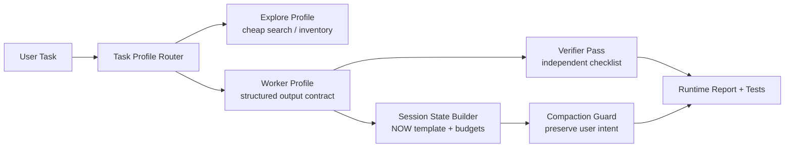

# Plan: Agent Runtime P0/P1 Hardening

## 问题框架

当前仓库已经有两块基础能力：

1. 稳定的恢复 runtime 宿主与 headless wrapper
2. 已通过兼容性验证的金融插件 surface

但在真正开始放大多 agent 能力之前，还缺少一层“可靠性优先”的工程化约束：

- 没有 `worker` 统一输出合同
- 没有 `verifier` 独立复核闭环
- 没有固定结构的 session state 模板
- 没有 compaction 后的用户原始意图保真层
- 没有面向低风险探索任务的低成本 profile 路由

这份计划的目标，不是继续扩张功能面，而是先补齐最值得学的 `P0 + P1` 能力，让后续的 memory、batch、security 能力建立在更稳的基础上。

## 范围边界

### In Scope

- 为 runtime orchestration 定义统一的 worker 输出合同
- 增加 verifier 复核流程与最小验证脚本/测试
- 设计并落地固定结构的 `NOW.md` session state 模板
- 为 compaction 增加“用户原始指令保留”约束
- 为探索类任务引入低成本 task profile 路由
- 为以上能力补齐测试、文档和回归检查

### Out of Scope

- 完整重写 `Dream Memory` 4 阶段系统
- 完整动态 memory file 路由
- 完整 `Security Monitor` 专职 agent 体系
- 完整 `Batch Orchestrator` 并行编排框架
- 先行修改大量 `vendor/claude-code-recovered/` 内部实现
- 金融研究 CLI 产品化阶段（Phase C）

## 需求追踪

本计划直接来自：

- 用户要求把“哪些能力值得部署、排序如何”固化成仓库内文档
- 新沉淀的学习文档
  - `docs/solutions/best-practices/agent-runtime-capability-prioritization-2026-03-31.md`
- 已存在的路线图
  - `docs/plans/2026-03-31-001-feat-financial-research-agent-roadmap-plan.md`

明确需求：

- 先做 `Verification Specialist` 与 `Worker Fork` 输出合同
- 同时补 `NOW.md` 固定结构、compaction 保留用户原始指令
- 用最小代价引入 `Explore` 便宜模型/低成本 profile
- 避免直接跳到复杂 memory、security、batch 能力

成功标准：

- 存在一套固定的 worker 输出合同与 verifier checklist
- 高风险/多步任务可通过统一 verifier pass 做二次检查
- 存在固定结构的 `NOW` 模板和意图保真模板
- 探索类任务可以通过 profile 路由到低成本模型配置
- 有测试能证明：
  - 输出合同没有缺段
  - 用户硬约束不会在压缩后丢失
  - verifier 能抓到关键缺陷

## 本地上下文与研究结论

### 已存在的宿主与测试面

- 现有 runtime 包装脚本和报告工具位于：
  - `scripts/runtime/run-financial-headless.ps1`
  - `scripts/runtime/runtime-report-lib.mjs`
  - `scripts/runtime/collect-runtime-init-report.mjs`
  - `scripts/runtime/collect-runtime-surface-diff.mjs`
- 现有回归测试位于：
  - `tests/runtime-host`
  - `tests/runtime-compat`

### 可复用的 runtime 内部模式

- verifier 相关宿主能力已存在参考实现：
  - `vendor/claude-code-recovered/src/tools/AgentTool/built-in/verificationAgent.ts`
- compaction 与 session memory 相关能力已存在：
  - `vendor/claude-code-recovered/src/services/compact/compact.ts`
  - `vendor/claude-code-recovered/src/services/compact/sessionMemoryCompact.ts`
  - `vendor/claude-code-recovered/src/utils/memoryFileDetection.ts`
- 任务/agent 编排相关参考：
  - `vendor/claude-code-recovered/src/skills/bundled/batch.ts`

### 关键结论

- 当前最该补的是 wrapper 层和流程层，不是先改 vendor runtime。
- `P0/P1` 的价值来自“防止结果漂移”，不是“增加更多能力”。
- 先做文档合同、profile、测试与轻量脚本，能最快验证这条路值不值得继续深入到 runtime 内部。

### 外部研究决策

这次不做外部研究。

原因：

- 当前计划完全建立在本仓 wrapper、tests、vendor 恢复 runtime 和已整理的学习结论上。
- 这是内部 orchestration 设计，不依赖外部框架最佳实践才能推进。

## 关键设计决策

### 1. 先做 wrapper-first，而不是 vendor-first

决定：

- `P0/P1` 第一阶段优先放在 `docs/runtime/`、`scripts/runtime/`、`tests/runtime-*`，避免一开始就改 `vendor/claude-code-recovered/`。

理由：

- 先用外层协议和测试验证价值，再决定是否下沉到 runtime 内核。
- 降低对恢复 runtime 的侵入，便于后续升级和替换。

### 2. 先做合同与验证，再做自动化扩张

决定：

- 输出合同与 verifier pass 先于 memory、batch、security monitor。

理由：

- 如果输出形状和验证闭环都没有固定，再强的 memory 或 batch 也只是放大混乱。

### 3. session state 模板提交到仓库，运行态状态文件不入库

决定：

- 提交模板和测试 fixture，不提交实际运行态 `NOW.md`。
- 实时状态文件使用稳定但 gitignored 的路径，例如 `runtime-state/`。

理由：

- 满足磁盘安全和 Git 安全要求。
- 让测试与文档可版本化，运行态文件仍保持临时性。

### 4. compaction 的首要目标是保留用户意图，不是做“更聪明的摘要”

决定：

- 压缩模板必须单列：
  - `User Intent`
  - `Hard Constraints`
  - `Non-goals`

理由：

- 金融研究和多 agent 流程里，最贵的错误是“总结变了，目标也被偷换了”。

### 5. 低成本 profile 只用于探索任务

决定：

- `Explore` profile 才允许使用低成本模型或更激进的 token 预算。
- `Worker` 和 `Verifier` 保持更稳的默认配置。

理由：

- 搜索、盘点、找文件属于低风险任务。
- 结论生成和复核不能因为省钱而变脆弱。

## 高层技术设计

设计重点不是“做更多 agent”，而是先把：

- 任务怎么分类
- worker 怎么输出
- verifier 怎么复核
- session state 怎么保真

这四件事定死。

## 系统级影响

受影响区域：

- `docs/runtime/`：新增操作合同和模板文档
- `scripts/runtime/`：新增 profile、session state、verifier wrapper
- `tests/runtime-host/`：新增 orchestration 行为测试
- `tests/fixtures/`：新增 worker 输出和 compaction fixture
- `.gitignore`：新增 `runtime-state/` 等运行态文件忽略

不应影响区域：

- 现有金融插件内容
- `vendor/claude-code-recovered/dist/`
- 已通过的 plugin surface 兼容性测试

## 实施单元

### [ ] 单元 1：定义 orchestration 合同与模板

**目标**

先把 `worker`、`verifier`、`NOW`、compaction 的合同写清楚，作为后续脚本和测试的单一真相源。

**主要文件**

- `docs/runtime/sub-agent-contract.md`
- `docs/runtime/verification-checklist.md`
- `docs/runtime/NOW-template.md`
- `docs/runtime/compaction-template.md`
- `tests/fixtures/runtime-orchestration/worker-output-valid.md`
- `tests/fixtures/runtime-orchestration/worker-output-invalid.md`
- `tests/fixtures/runtime-orchestration/compaction-summary-valid.md`
- `tests/fixtures/runtime-orchestration/compaction-summary-invalid.md`

**测试文件**

- `tests/runtime-host/worker-output-contract.test.mjs`
- `tests/runtime-host/compaction-intent-template.test.mjs`

**Execution note**

- contract-first

**Patterns to follow**

- `scripts/runtime/*.mjs` 现有报告脚本的 summary 结构
- `docs/solutions/*` 已沉淀的 best-practice 文档格式

**实现方式**

- 用 Markdown 合同起步，不先做复杂协议或 vendor runtime patch。
- worker 合同至少要求：
  - `Conclusion`
  - `Confirmed`
  - `Unconfirmed`
  - `Risks`
  - `Next Step`
- compaction 模板至少要求：
  - `User Intent`
  - `Hard Constraints`
  - `Non-goals`
  - `Current State`
  - `Next Step`

**测试场景**

- 合法 worker 输出能通过结构校验
- 缺 `Unconfirmed` 或 `Risks` 的输出会被拒绝
- 合法 compaction 摘要保留原始用户意图
- 摘要缺失 `Hard Constraints` 或 `Non-goals` 会被拒绝

**Verification**

- 文档和 fixtures 足够明确，使后续脚本能在不猜测语义的情况下校验格式

### [ ] 单元 2：落地 worker/verifier wrapper 与 task profile

**目标**

在现有 headless wrapper 外再包一层 task profile 路由和 verifier pass，不改动金融插件本身。

**主要文件**

- `scripts/runtime/task-profiles.json`
- `scripts/runtime/run-task-profile.mjs`
- `scripts/runtime/run-verification-pass.mjs`
- `scripts/runtime/runtime-report-lib.mjs`
- `scripts/runtime/run-financial-headless.ps1`

**测试文件**

- `tests/runtime-host/task-profile-routing.test.mjs`
- `tests/runtime-host/verification-pass.test.mjs`

**Execution note**

- wrapper-first

**Patterns to follow**

- `scripts/runtime/run-financial-headless.ps1`
- `scripts/runtime/runtime-report-lib.mjs`
- `vendor/claude-code-recovered/src/tools/AgentTool/built-in/verificationAgent.ts`

**实现方式**

- 引入最小 profile 集：
  - `explore`
  - `worker`
  - `verifier`
- `explore` 可绑定低成本模型/更小预算
- `worker` 强制输出合同
- `verifier` 读取 worker 输出并按 checklist 回答：
  - 事实是否被标为 confirmed/unconfirmed
  - 是否缺关键风险
  - 是否有越界结论

**测试场景**

- `explore` profile 会使用指定配置，且不影响 `worker`/`verifier`
- 合法 worker 输出能被 verifier 通过
- 非法 worker 输出会被 verifier 标记失败
- verifier 缺失输入或输入不合格时返回明确错误

**Verification**

- 能从 wrapper 层稳定触发 `explore -> worker -> verifier` 的最小闭环

### [ ] 单元 3：落地 session state 与 compaction 意图保真

**目标**

把长任务状态管理从“自由发挥”变成固定结构，确保压缩前后任务意图不漂移。

**主要文件**

- `docs/runtime/NOW-template.md`
- `scripts/runtime/build-session-state.mjs`
- `scripts/runtime/preserve-user-intent.mjs`
- `runtime-state/NOW.md`（运行态，gitignored）
- `runtime-state/INTENT.md`（运行态，gitignored）
- `.gitignore`

**测试文件**

- `tests/runtime-host/session-memory-state.test.mjs`
- `tests/runtime-host/intent-preservation.test.mjs`
- `tests/fixtures/runtime-state/sample-user-intent.md`

**Execution note**

- characterization-first

**Patterns to follow**

- `vendor/claude-code-recovered/src/services/compact/sessionMemoryCompact.ts`
- `vendor/claude-code-recovered/src/services/compact/compact.ts`
- `vendor/claude-code-recovered/src/utils/memoryFileDetection.ts`

**实现方式**

- 提交模板，不提交实际运行态 state 文件。
- `build-session-state.mjs` 负责：
  - 固定段落顺序
  - 每段 token 预算
  - 超长时优先压缩内容，不改变段落结构
- `preserve-user-intent.mjs` 负责把原始用户要求抽成最小清单并强制出现在 compaction 摘要中。

**测试场景**

- `NOW` 文件总是按固定段落顺序生成
- 任一段超长时会被压缩，而不是删掉整个段落
- 原始用户硬约束能在 compaction 结果中保留
- 非目标内容不会被抬升成新需求

**Verification**

- 长任务 state 更新后仍能稳定回答“当前目标、已确认、未确认、下一步”

### [ ] 单元 4：把 P0/P1 能力接入现有 runtime 回归面

**目标**

确保新增 orchestration 层不会破坏现有 headless host 和 plugin compatibility。

**主要文件**

- `tests/runtime-host/build-and-help.test.mjs`
- `tests/runtime-host/print-stream-json.test.mjs`
- `tests/runtime-host/verification-pass.test.mjs`
- `tests/runtime-host/task-profile-routing.test.mjs`
- `tests/runtime-compat/runtime-surface-diff.test.mjs`
- `docs/runtime/README.md`

**Execution note**

- regression-first

**Patterns to follow**

- 现有 `tests/runtime-host/*.test.mjs`
- 现有 `tests/runtime-compat/*.test.mjs`

**实现方式**

- 保持 Phase A/B 已验证路径不回退：
  - `--bare`
  - `--strict-mcp-config`
  - `--print`
  - `--verbose`
  - `stream-json`
- 把新增能力限制在 wrapper 层，回归中同时覆盖：
  - 宿主可用性
  - profile 路由
  - verifier pass
  - session state/intent 保真

**测试场景**

- 现有 host 测试继续通过
- 现有 compat 测试继续通过
- P0/P1 新增测试全部通过
- `runtime-state/` 等运行态文件不会被误纳入版本控制

**Verification**

- 完整回归通过后，P0/P1 层可作为后续 memory/batch/security 能力的底座

## 依赖与顺序

推荐顺序：

1. 单元 1：先定合同
2. 单元 2：再做 worker/verifier wrapper
3. 单元 3：再做 session state 和 compaction 保真
4. 单元 4：最后做整体验证与文档整合

依赖关系：

- 单元 2 依赖单元 1 的合同定义
- 单元 3 依赖单元 1 的 compaction 模板
- 单元 4 依赖前三个单元都完成

## 测试策略

核心测试分三层：

1. `fixture/schema` 层
   - 校验 worker 输出和 compaction 摘要模板
2. `wrapper behavior` 层
   - 校验 profile 路由、verifier pass、session state builder
3. `runtime regression` 层
   - 保证现有 Phase A/B 能力不退化

最低回归集建议：

- `node --test tests/runtime-host/*.test.mjs`
- `node --test tests/runtime-compat/*.test.mjs`

## 风险与隐藏成本

- 当前 runtime 的 per-task profile 切换可能没有现成的一等支持，第一版可能需要 wrapper 配置模拟。
- 如果过早把 P0/P1 下沉到 `vendor/claude-code-recovered/`，后续升级成本会明显上升。
- `NOW` 模板如果设计过重，会反过来制造维护负担，所以第一版必须克制。
- verifier 规则过严会降低流程流畅度，过松则失去价值，需要通过 fixture 和回归逐步校准。

## Implementation-Time Unknowns

- `explore` profile 的最低可接受模型/预算边界是多少
- verifier 第一版采用 Markdown 合同校验还是结构化 JSON 校验更稳
- `runtime-state/` 的最终目录命名是否需要结合现有本地配置约定调整

这些都应在实现阶段通过小步验证解决，而不是现在为此扩大范围。

## 一句话结论

这份计划的核心不是“把 Claude Code 全部复刻下来”，而是先把最值钱的 `P0/P1` 能力做成 wrapper 层的可靠性底座：`verifier + worker 合同 + NOW 模板 + intent-preserving compaction + cheap explore routing`。
