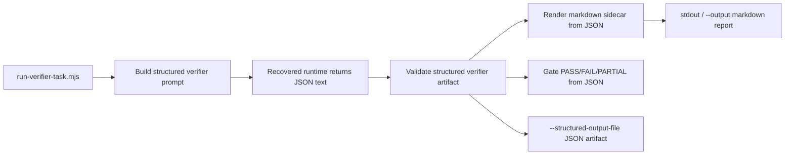

# Plan: Structured Verifier Mode

## Problem Frame

The wrapper-layer verifier is now the main correctness gate for real tasks, but
its success criteria still depend on parsing markdown text. The remaining risk
is not that the verifier lacks a checklist; it is that a mostly-correct review
can still fail or drift at the formatting layer. This plan moves verifier
authority to a structured JSON artifact while preserving the current
human-readable workflow through a wrapper-rendered markdown sidecar.

This plan is bounded to the verifier path only. It does not expand into
structured worker output, runtime attempt ledgers, or vendor-runtime surgery
(see origin: `docs/brainstorms/2026-04-01-structured-verifier-mode-requirements.md`).

## Requirements Trace

**Authoritative verifier artifact**
- R1-R5: introduce a structured JSON verifier contract, make it sufficient for
  wrapper pass/fail gating, and derive markdown deterministically from it

**Compatibility and rollout**
- R6-R10: keep rollout opt-in, preserve fail-closed and retry behavior, avoid
  worker-contract changes, and stay wrapper-first

**Validation and operator workflow**
- R11-R13: add deterministic validation paths, durable fixtures/tests, and keep
  the operator-facing markdown experience readable

## Context & Research

### Relevant Existing Patterns

- `scripts/runtime/run-verifier-task.mjs`
  - current verifier entrypoint
  - already owns preflight, retries, output writing, and wrapper-level gating
- `scripts/runtime/orchestration-lib.mjs`
  - current home of verifier prompt construction, markdown parsing, retry
    directives, and validation helpers
- `scripts/runtime/run-verification-pass.mjs`
  - existing deterministic validator with `text|json` output modes
  - closest local pattern for adding another structured validation mode
- `scripts/runtime/runtime-report-lib.mjs`
  - central UTF-8 artifact writing helper and runtime CLI wrapper
- `tests/runtime-host/worker-verifier-entrypoints.test.mjs`
  - current contract/parser coverage for verifier wrapper behavior
- `tests/runtime-host/verification-pass.test.mjs`
  - current deterministic validation coverage
- `tests/fixtures/runtime-orchestration/verifier-output-valid.md`
  - current verifier markdown fixture and operator-facing shape

### Repo Learnings To Reuse

- The wrapper-first strategy is already working; the last reliability gains came
  from tightening scripts and tests, not from editing recovered vendor code.
- The repo already uses structured artifact plus report patterns in other
  systems such as run-record and evaluation-summary flows. The structured
  verifier should follow that discipline rather than inventing a second
  markdown-only contract.
- Existing runtime scripts already expose `--json` or `--format json` patterns.
  Structured verifier mode should reuse those conventions where they fit,
  instead of creating a one-off shape.

### External Research Decision

No external research is needed. This is a wrapper-internal change with strong
local patterns and no meaningful external protocol or compliance dependency.

## Key Technical Decisions

### 1. The verifier's source of truth becomes JSON, not markdown

The verifier model will be asked for a structured JSON artifact in structured
mode. Wrapper gating will validate that JSON artifact directly rather than
parsing markdown text.

Rationale:
- fixes the current residual fragility at the correct layer
- avoids keeping two independently authored truth sources
- creates a durable seam for later ledgers and regression fixtures

### 2. Markdown remains the operator surface, but only as a derived sidecar

The wrapper will render the familiar verifier report from the structured JSON
artifact and use that rendered markdown for stdout and `--output` behavior in
structured mode.

Rationale:
- preserves current operator readability
- prevents drift between machine and human artifacts
- keeps downstream manual inspection familiar

### 3. Rollout stays wrapper-local and opt-in

Structured verifier mode will be enabled with wrapper-level flags:
- `--structured-verifier`
- `--structured-output-file <path>` for optional persisted JSON artifact

Default verifier behavior remains unchanged.

Rationale:
- smallest blast radius
- easier regression isolation
- avoids implicit behavior changes in existing runtime scripts and manuals

### 4. Deterministic validation extends the existing verification-pass tool

`scripts/runtime/run-verification-pass.mjs` will gain a structured-verifier mode
instead of introducing a second validator script.

Rationale:
- keeps validation entrypoints compact
- follows the current `worker|compaction` deterministic validation pattern
- makes structured-mode preflight and fixture checks easy to automate

### 5. V1 schema scope stays narrow

V1 structured output covers only the final verifier report:
- schema version
- verdict
- adversarial-probe presence
- checks with required fields

It does not include deterministic preflight data or retry-attempt metadata.

Rationale:
- aligns with the brainstorm scope boundary
- reduces schema churn in the first phase
- keeps the migration target small enough to stabilize quickly

## High-Level Technical Design

This diagram is directional guidance, not implementation code.



### Directional Contract Sketch

```json
{
  "schemaVersion": "structured-verifier-v1",
  "verdict": "PASS",
  "hasAdversarialProbe": true,
  "checks": [
    {
      "title": "Contract scan",
      "commandRun": "local contract validation",
      "outputObserved": "All required sections are present.",
      "result": "PASS",
      "isAdversarialProbe": false
    }
  ]
}
```

Directional notes:
- `checks` is the minimum durable list the wrapper needs to gate and render
- markdown rendering should map this artifact back into the current
  `### Check:` style report
- the parser should fail closed when required fields are missing or malformed

## Implementation Units

### [ ] Unit 1: Define the structured verifier artifact contract

**Goal**

Create one explicit schema and fixture set so prompt, parser, renderer, and
tests all target the same artifact.

**Execution posture**

Characterization-first. Keep the current markdown contract untouched while
introducing the structured artifact beside it.

**Files**

- `docs/runtime/structured-verifier-schema.md`
- `scripts/runtime/orchestration-lib.mjs`
- `tests/fixtures/runtime-orchestration/structured-verifier-valid.json`
- `tests/fixtures/runtime-orchestration/structured-verifier-invalid-missing-verdict.json`
- `tests/fixtures/runtime-orchestration/structured-verifier-invalid-missing-check-field.json`
- `tests/fixtures/runtime-orchestration/structured-verifier-rendered-valid.md`

**Tests**

- `tests/runtime-host/structured-verifier-contract.test.mjs`

**Approach**

- Add a schema description doc under `docs/runtime/` so the contract is visible
  outside the code
- Introduce shared helpers in `orchestration-lib.mjs` for:
  - validating structured verifier JSON
  - detecting adversarial probes from structured checks
  - rendering markdown sidecars from structured verifier data
- Keep the helpers adjacent to current verifier helpers so the old and new
  paths can coexist during rollout

**Test scenarios**

- Accept a valid structured verifier artifact with a PASS verdict
- Reject a structured verifier artifact with no verdict
- Reject a structured verifier artifact whose check omits one required field
- Reject a structured verifier artifact with no adversarial probe
- Render markdown deterministically from the valid JSON fixture

### [ ] Unit 2: Integrate opt-in structured mode into the verifier wrapper

**Goal**

Teach the verifier wrapper to request, validate, gate, render, and optionally
persist the structured artifact without changing default behavior.

**Execution posture**

Characterization-first for the existing entrypoint contract, then extend with an
opt-in branch.

**Files**

- `scripts/runtime/run-verifier-task.mjs`
- `scripts/runtime/orchestration-lib.mjs`
- `docs/runtime/verification-checklist.md`

**Tests**

- `tests/runtime-host/worker-verifier-entrypoints.test.mjs`
- `tests/runtime-host/structured-verifier-entrypoints.test.mjs`

**Approach**

- Add `--structured-verifier` and `--structured-output-file <path>` to the
  wrapper CLI
- In structured mode:
  - build a stricter prompt that asks for JSON only
  - parse and validate the returned JSON artifact
  - gate success/failure from the JSON artifact
  - render markdown sidecar for stdout and `--output`
  - optionally persist the JSON artifact to the explicit structured-output path
- Preserve current retry behavior, but update retry prompts so retries reinforce
  JSON-only structured output rather than markdown headings
- Leave the existing markdown parser path intact when the flag is absent

**Test scenarios**

- Dry-run advertises structured mode and the new artifact paths without changing
  existing default dry-run behavior
- Structured mode accepts valid JSON, prints rendered markdown, and optionally
  writes the JSON artifact to disk
- Structured mode rejects malformed JSON and surfaces a fail-closed error
- Structured mode retries when the runtime returns empty stdout or invalid JSON
- Non-structured mode remains behaviorally unchanged

### [ ] Unit 3: Extend deterministic validation and local-only workflows

**Goal**

Make structured verifier artifacts testable and inspectable without a live model
call wherever practical.

**Execution posture**

Deterministic-first. Prefer local validation seams before live runtime checks.

**Files**

- `scripts/runtime/run-verification-pass.mjs`
- `scripts/runtime/orchestration-lib.mjs`
- `docs/runtime/README.md`
- `docs/runtime/OPERATOR-MANUAL.md`

**Tests**

- `tests/runtime-host/verification-pass.test.mjs`
- `tests/runtime-host/structured-verifier-contract.test.mjs`

**Approach**

- Add a new deterministic mode to `run-verification-pass.mjs`, such as
  `structured-verifier`, that validates a structured JSON artifact and can emit
  both text and JSON reports
- Ensure `run-verifier-task.mjs --local-only` can still be used as a cheap
  validation entrypoint around the structured path where practical
- Document the new flags, artifact expectations, and operator workflow with
  copy-pasteable examples

**Test scenarios**

- Deterministic validation passes for the valid structured verifier fixture
- Deterministic validation fails with explicit reasons for invalid structured
  fixtures
- Text-mode validation summary emits a readable verdict
- JSON-mode validation summary emits machine-readable details for tests

### [ ] Unit 4: Lock compatibility and regression boundaries

**Goal**

Prevent the structured migration from regressing the existing wrapper path.

**Execution posture**

Regression-first.

**Files**

- `tests/runtime-host/worker-verifier-entrypoints.test.mjs`
- `tests/runtime-host/verification-pass.test.mjs`
- `tests/runtime-host/build-and-help.test.mjs`
- `tests/runtime-compat/runtime-surface-diff.test.mjs`

**Tests**

- `tests/runtime-host/worker-verifier-entrypoints.test.mjs`
- `tests/runtime-host/verification-pass.test.mjs`
- `tests/runtime-host/build-and-help.test.mjs`
- `tests/runtime-compat/runtime-surface-diff.test.mjs`

**Approach**

- Keep the default verifier path under existing tests
- Add targeted structured-mode tests without rewriting current markdown-path
  fixtures or assumptions unnecessarily
- Use the compatibility suite to confirm the runtime surface did not drift
  unintentionally

**Test scenarios**

- Existing markdown-path verifier tests still pass unchanged
- Existing validation-pass worker/compaction modes still pass unchanged
- Help/build/runtime surface checks still pass
- Structured mode introduces no unplanned plugin or runtime-surface changes

## System-Wide Impact

- The verifier wrapper CLI surface gains two new flags:
  - `--structured-verifier`
  - `--structured-output-file <path>`
- Structured-mode runs may now produce two artifacts:
  - rendered markdown report
  - authoritative JSON verifier artifact
- `scripts/runtime/orchestration-lib.mjs` becomes the shared home for both
  markdown-path and structured-path verifier helpers
- Operator docs and examples must be kept in sync with the new mode
- Worker scripts, task profiles, plugin routing, and recovered runtime binaries
  remain unchanged by default

## Risks & Dependencies

### Main Risks

- The model may still drift from valid JSON under retry pressure
  - Mitigation: fail closed, keep retries explicit, and keep schema scope narrow
- The JSON artifact and markdown sidecar could diverge if rendering logic leaks
  business logic
  - Mitigation: make markdown a pure render of JSON, not a second validation path
- The new flags could create operator confusion if output semantics are unclear
  - Mitigation: keep `--output` as markdown sidecar and require a separate
    explicit path for authoritative JSON persistence
- Test coverage could overfit fixture shape and miss live prompt drift
  - Mitigation: keep both deterministic fixture tests and wrapper entrypoint
    tests

### Dependencies

- Existing wrapper retry and output-writing helpers in
  `scripts/runtime/run-verifier-task.mjs` and
  `scripts/runtime/runtime-report-lib.mjs`
- Existing verifier checklist and parser logic in
  `scripts/runtime/orchestration-lib.mjs`
- Existing runtime host test harness under `tests/runtime-host/`

## Open Questions

### Resolved During Planning

- The authoritative artifact is JSON, not markdown.
- Markdown remains, but only as a wrapper-rendered sidecar.
- Rollout is opt-in.
- V1 scope is the final verifier report only.
- This work stays wrapper-first and does not require worker-contract changes.

### Deferred To Implementation

- Whether the final schema field casing should follow existing JS helper naming
  (`camelCase`) or broader repo artifact conventions (`snake_case`)
- Whether structured-mode local-only validation should accept only standalone
  JSON fixtures or also support round-tripping through rendered markdown for
  debugging

## Sources & References

- Origin requirements:
  - `docs/brainstorms/2026-04-01-structured-verifier-mode-requirements.md`
- Current verifier wrapper:
  - `scripts/runtime/run-verifier-task.mjs`
  - `scripts/runtime/orchestration-lib.mjs`
- Current deterministic validator:
  - `scripts/runtime/run-verification-pass.mjs`
- Current runtime helpers:
  - `scripts/runtime/runtime-report-lib.mjs`
- Current verifier tests and fixtures:
  - `tests/runtime-host/worker-verifier-entrypoints.test.mjs`
  - `tests/runtime-host/verification-pass.test.mjs`
  - `tests/fixtures/runtime-orchestration/verifier-output-valid.md`
